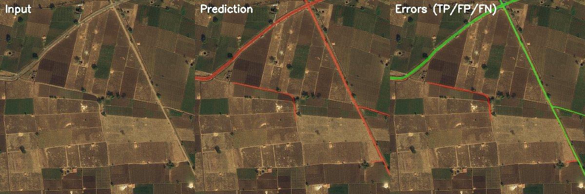
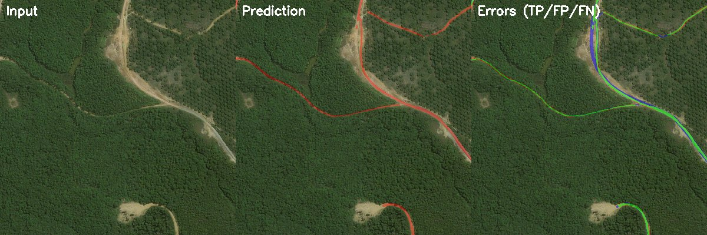
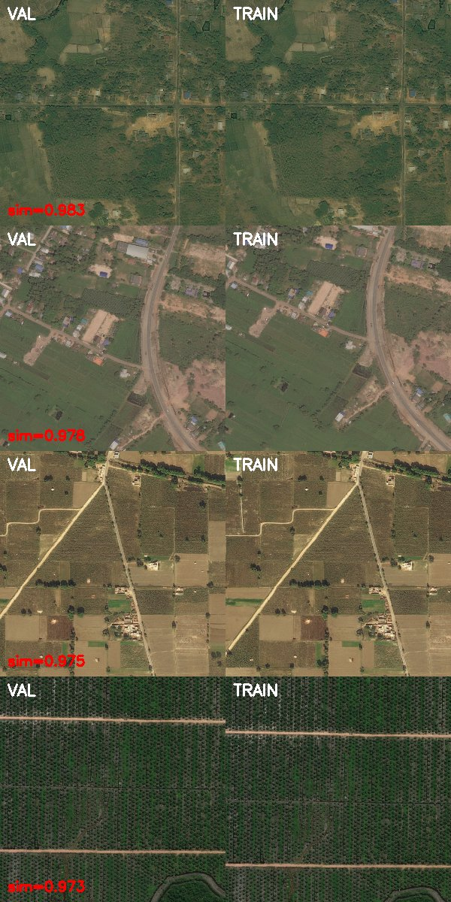

# Write-Up: Approach, Design Decisions, and Trade-offs

This document covers the reasoning behind the modeling choices, experimental results, and production design for the road segmentation system. For setup and usage instructions, see [README.md](README.md).

---

## Results

### Step 1: Architecture Selection

I first compared 4 architectures on a small subset (1000 samples, 15 epochs) to select the best family before investing in full training. All models used ImageNet-pretrained encoders and identical augmentations for a fair comparison.

| Rank | Model | IoU | Dice | Params | Time |
|------|-------|-----|------|--------|------|
| 1 | **U-Net + ResNet34** | **0.528** | 0.691 | 24.4M | 10 min |
| 2 | LinkNet + ResNet34 | 0.507 | 0.673 | 21.8M | 9 min |
| 3 | SegFormer + MIT-B2 | 0.485 | 0.653 | 24.7M | 15 min |
| 4 | DeepLabV3+ + ResNet50 | 0.484 | — | 26.7M | 10 min |

U-Net won convincingly. The full details are in [notebook 02](notebooks/02_model_comparison.ipynb).

### Step 2: Scale Up to Best Model

Based on the comparison, I selected the U-Net family and scaled up in three ways:
- **Better decoder**: UNet++ (dense nested skip connections) instead of vanilla U-Net, which better preserves thin road features
- **Stronger encoder**: EfficientNet-B4 (NAS-optimized compound scaling) instead of ResNet34
- **Full resolution**: 1024x1024 instead of 512x512, so thin roads (~10px) aren't lost to downsampling

I also experimented with boundary-weighted loss (5x weight on road edge pixels) as a fine-tuning step, but the model was already well-calibrated and the gain was minimal.

### Step 3: Final Model

| Metric | Value |
|--------|-------|
| Architecture | UNet++ + EfficientNet-B4 |
| Input | 1024x1024 (full resolution) |
| **Val IoU** | **0.7016** |
| **Val Dice** | **0.8246** |
| Training | 50 epochs, 5292 train / 934 val |

Full training logs and curves are in the [W&B training report](https://api.wandb.ai/links/minaessam/ufwt8pum).

#### Sample Predictions

Input image | prediction overlay (red = road) | error map (green = TP, red = FP, blue = FN):





### Step 4: Data Leakage Analysis

DeepGlobe tiles are cut from larger satellite images, so adjacent tiles in train and val sets may share geographic context (same road continuing across tile boundaries). A random train/val split has no way to know which tiles are geographically adjacent, since the dataset provides no coordinate metadata.

**The intuition:** If two images are from the same geographic area, their visual content should be similar : similar buildings, vegetation, road patterns. By computing embedding vectors for each image and measuring cosine similarity between train and val samples, I can detect pairs that are suspiciously similar and likely come from adjacent or overlapping tiles.

I explored two embedding models to see if they capture different notions of similarity:

- **ResNet50 (ImageNet pretrained)**  a CNN whose features are learned for image classification. Mean pairwise similarity across val-train pairs was **0.45**

- **CLIP ViT-B/32**  a vision transformer trained on image-text pairs via contrastive learning. Mean pairwise similarity was much higher (**0.82**), suggesting CLIP's embedding space clusters satellite images more tightly than ResNet's.

The correlation between the two models' similarity scores was **0.335** — they flag different pairs, which is why I used both. After visually inspecting the most similar pairs at different similarity cutoffs, I chose thresholds where "clearly the same geographic area" transitions to "just similar-looking satellite imagery":
- **ResNet >= 0.93** — above this, pairs consistently showed the same road structures and building layouts
- **CLIP >= 0.96** — needed a higher cutoff because CLIP scores were generally higher across all pairs

These thresholds are empirical, not principled — I chose them by looking at the images. The visual evidence is in [notebook 04](notebooks/04_data_leakage_check.ipynb).

To focus the analysis where leakage matters most, I compared only the top-500 highest-IoU samples from each set — if leakage inflates metrics, it would be most visible in the samples where the model performs best. I then took the union of samples flagged by either method:

| | Count | Mean IoU |
|---|---|---|
| **Total val samples** | 934 | 0.694 |
| **Flagged as leaky** | 123 (13%) | 0.829 |
| **Clean (after removal)** | 811 | **0.675** |
| **IoU inflation** | | **1.9%** |

The leaky samples have significantly higher IoU (0.829 vs 0.675) because the model effectively saw their geographic context during training. The 1.9% inflation is minor, but I report both metrics for transparency.

#### Most Similar Val-Train Pairs (ResNet embeddings)

Each row shows a validation image (left) and its most similar training image (right), with cosine similarity score:



Full analysis with more visualizations in [notebook 04](notebooks/04_data_leakage_check.ipynb).

### Step 5: Post-Processing Ablation

I tested each post-processing step independently to measure its contribution. Each step is documented in detail in [docs/postprocessing_review.md](docs/postprocessing_review.md).

| Step | IoU | Delta | Verdict |
|------|-----|-------|---------|
| Raw threshold (0.5) | 0.7016 | baseline | — |
| [Optimal threshold](docs/postprocessing_review.md#2-probability-to-mask-conversion) (0.45) | 0.7017 | +0.01% | Neutral |
| [+ Component filter](docs/postprocessing_review.md#4-connected-component-and-segment-filtering) | 0.7019 | +0.02% | Neutral |
| [+ Morphological closing](docs/postprocessing_review.md#3-morphological-cleanup) | 0.7012 | -0.04% | Skip |
| [+ Morphological opening](docs/postprocessing_review.md#3-morphological-cleanup) | 0.7012 | +0.00% | Neutral |
| [+ Gap bridging](docs/postprocessing_review.md#7-connectivity-repair-via-graph-reasoning) | 0.7012 | +0.00% | Neutral |
| [TTA (6-fold)](docs/postprocessing_review.md#10-test-time-augmentation-as-prediction-refinement) | 0.7014 | +0.65%* | Include |

*TTA gain measured on a 100-sample subset where the baseline IoU was lower (0.695), so the absolute gain is real but specific to harder samples.

**Conclusion**: the model produces clean predictions at threshold 0.5. Post-processing adds marginal value. I include TTA as an optional flag in the API for offline batch processing where latency is less critical.

### Step 6: Model Optimization

I exported the trained model to ONNX and tested FP16 and INT8 compression on a T4 GPU:

| Variant | Latency | Speedup | IoU | Size |
|---------|---------|---------|-----|------|
| PyTorch FP32 | 145.6 ms | 1.00x | 0.6835 | — |
| PyTorch FP16/AMP | 95.5 ms | 1.52x | 0.6835 | — |
| ONNX FP32 | 135.7 ms | 1.07x | 0.6835 | 80 MB |
| **ONNX FP16** | **78.3 ms** | **1.86x** | **0.6835** | **40 MB** |
| ONNX INT8 (CPU) | — | — | — | 21 MB |

**Zero IoU loss** across all variants. FP16 weights stay in float16 during GPU inference (using Tensor Cores), which explains the 1.86x speedup. I verified this by running all variants on 200 validation samples and comparing outputs. Full benchmark in [notebook 07](notebooks/07_model_optimization.ipynb).

---

## Design Decisions

### Why UNet++ + EfficientNet-B4?

**Architecture selection was data-driven, not assumed.** I ran a preliminary comparison of 4 architectures (U-Net, LinkNet, SegFormer, DeepLabV3+) on 1000 samples to identify the best family, then scaled up the winner.

**U-Net family won because** skip connections concatenate encoder features directly to the decoder, preserving fine spatial detail. Roads are thin structures (some as narrow as 10 pixels at 1024x1024) where this detail matters. UNet++ extends this with dense nested skip connections that capture features at multiple semantic scales.

**EfficientNet-B4 over ResNet34 because** EfficientNet uses compound scaling (depth + width + resolution simultaneously, discovered via neural architecture search) which extracts richer features at similar parameter count (19M vs 22M). The "Battle of the Backbones" study (NeurIPS 2023) found EfficientNet to be the best overall backbone for efficiency-accuracy tradeoff.

**I chose not to use D-LinkNet** (the original DeepGlobe challenge winner) because: (1) its code requires Python 2.7 and PyTorch 0.2, (2) the pretrained weights are hosted on personal Dropbox/Baidu links with no integrity verification, and (3) SMP's LinkNet + ResNet34 provides a production-quality approximation that I tested in the comparison.

**Full resolution (1024x1024) instead of 512x512** because training at native resolution gave a **5% IoU boost, 3% recall improvement, and 2.5% precision improvement** over 512x512 — a significant gain that justifies the slower training. The EDA confirmed why: road widths are as narrow as 10px at 1024, which halve to 5px at 512 where they become unreliable to segment.

### Why BCE + Dice Loss?

The EDA revealed that roads cover only **4.3% of pixels on average** (median 2.15%). This severe class imbalance means:

- **Plain BCE fails** — gradients are dominated by the 96% background pixels, so the model learns to predict "no road" everywhere.
- **Pixel accuracy is useless** — a model predicting all-background achieves 96% accuracy.
- **BCE + Dice compound loss** combines the best of both: BCE provides stable per-pixel gradients for learning, while Dice directly optimizes the overlap metric and is inherently imbalance-resistant (it only considers the ratio of overlap to total predicted+actual, not the background).

I also implemented and tested **boundary-weighted BCE+Dice** (5x weight on road edge pixels) for fine-tuning. The literature reports +2-5 IoU points from this technique on road extraction. In my case, the gain was minimal because the base model was already well-calibrated — the post-processing ablation confirmed this.

### Why IoU as the Primary Metric?

**IoU (Intersection over Union)** penalizes both false positives and false negatives equally, making it the standard for segmentation tasks with class imbalance. I also report:

- **Dice** — monotonically related to IoU, easier to interpret (harmonic mean of precision and recall)
- **Precision / Recall** — to understand whether the model over-predicts (high FP) or under-predicts (high FN)
- **Calibration (ECE)** — to verify that confidence scores are trustworthy, which matters for the gap-bridging post-processing and the `confidence_mean` field in the API response

I intentionally **do not report pixel accuracy** because it's meaningless at 96% background.

### How I Split the Data

Only the train set (6,226 samples) has ground truth masks — the valid and test sets have no masks. I split train into **85% train (5,292) / 15% val (934)** using stratified sampling by road coverage percentage. This ensures both splits have similar distributions of sparse and dense road images.

The stratification uses `sklearn.train_test_split` with `stratify=coverage_bins` (quantile-based bins). The split seed (42) is separate from the training seed, so changing training randomness doesn't change which samples are in validation — this makes model comparison fair.

I then verified split integrity via the data leakage analysis (see Results section).

---

## Production Considerations

### Scalability

The inference service is **stateless** — no session state between requests. This means scaling horizontally is straightforward:

- **Multiple replicas** behind a load balancer (Kubernetes Deployment, AWS ECS). Each replica loads the ONNX model into memory independently. No shared state needed.
- **Batch processing**: For processing thousands of tiles, decouple submission from inference using a task queue (Celery + Redis, or AWS SQS). Workers pull tiles from the queue and write results to object storage.
- **Large image tiling**: Satellite images larger than 1024x1024 would be tiled with 128-256px overlap, each tile processed independently, then stitched back using only the central region of each prediction (discarding the "halo" border to avoid boundary artifacts).

I have not implemented a task queue or tiling service — the API handles single-image requests only. These would be the first additions for production scale.

### Latency

Current latency on a T4 GPU is **78ms per 1024x1024 image** (ONNX FP16). For stricter budgets:

- **TensorRT** — layer fusion and kernel auto-tuning on top of ONNX could provide an additional 2-3x speedup. I have not implemented this because it requires NVIDIA-specific tooling and a GPU build environment, but the ONNX model is TensorRT-compatible.
- **Dynamic batching** — when serving multiple concurrent requests, accumulate them into a batch (e.g., 8 images) and run a single forward pass. ONNX Runtime and Triton Inference Server both support this natively.
- **INT8 on CPU** — the 21 MB INT8 model enables inference on CPU-only instances (no GPU required). Latency is higher (~3 seconds at 1024x1024) but the model size and cost are minimal.

The ONNX export uses fixed input dimensions (1024x1024) rather than dynamic shapes because UNet++ has shape-dependent operations that cause issues with dynamic ONNX export. This is documented in `api/optimize.py`.

### Model Lifecycle

Models are versioned in the **W&B Model Registry** as artifacts:

```bash
# Upload a new version
python scripts/upload_model.py --checkpoint checkpoints/best.pth --onnx-dir models/ --version v2.0

# Download a specific version
python scripts/download_model.py --version v1

# Download latest
python scripts/download_model.py
```

Each artifact stores: the PyTorch checkpoint (for retraining), ONNX FP32/FP16/INT8 (for deployment), and the full training config (for reproducibility).

**For A/B testing**: deploy two model versions behind a traffic-splitting proxy, route a percentage to the new version, and compare IoU on a held-out labeled set. **For rollback**: point the deployment config back to the previous artifact version — the old model is still in the registry.

I have not implemented A/B testing or automated rollback — these would require infrastructure (traffic routing, automated metric comparison) beyond the scope of this project.

### Data Drift

Satellite imagery varies by provider, resolution, season, and geography. The inference audit logging (in `api/observability.py`) already captures per-request statistics that could feed a drift detection system:

```json
{"event": "inference", "image_hash": "3f8a9bc2", "road_coverage_pct": 4.2, "confidence_mean": 0.87, "inference_time_ms": 78.3}
```

**Detection strategy** (not implemented, but designed for):

1. **Input monitoring**: Compute per-image RGB channel means and standard deviations. Compare to the **training set distribution** computed during EDA (notebook 01 reports the actual dataset channel statistics, which differ from ImageNet normalization values). Use KL divergence between the running distribution and the training baseline. Alert when divergence exceeds a threshold (e.g., > 0.1) sustained over 100 consecutive images — a persistent shift suggests a new imagery source, season, or sensor.

2. **Prediction monitoring**: Track `road_coverage_pct` and `confidence_mean` from the inference audit log (already captured per request by `api/observability.py`). Maintain a 1000-request sliding window and compare its distribution to a baseline window from initial deployment using a Kolmogorov-Smirnov test. For example: if the training set has mean road coverage of 4.3%, and the sliding window suddenly shifts to 8% or 1%, that indicates either the model is seeing a different geographic region (legitimate shift) or the model is degrading (hallucinating roads or missing them). The distinction requires human review, but the alert surfaces it early.

3. **Calibration monitoring**: Periodically collect a small labeled sample from new production data and recompute the ECE (Expected Calibration Error) using the same method as notebook 05. If ECE increases above 0.05, the model's confidence scores are no longer reliable — this directly affects the confidence-weighted gap bridging in post-processing and the `confidence_mean` value reported to users.

4. **Retraining trigger**: When drift is confirmed, retrain on a mix of original and new data using the same config system and W&B tracking. The deterministic split and versioned configs ensure reproducibility.

### Dataset Versioning

The DeepGlobe dataset is fixed (single version on Kaggle), so I did not implement formal dataset versioning (DVC, W&B dataset artifacts). Reproducibility is ensured through:

- Deterministic train/val split (seed=42, ratio=0.15) recorded in every checkpoint config
- The download script always fetches the same Kaggle dataset version
- In production, dataset changes would be tracked via content hashing and W&B artifacts, with retraining triggered when the dataset hash changes

### Docker Image and Model Weights

The Docker image does **not** include model weights. They are either:
- Mounted at runtime via volume (`-v ./models:/app/models`)
- Auto-downloaded from W&B on first start (if `WANDB_API_KEY` is set)

This is the standard production pattern because the image stays small (~2 GB), the same image works with any model version, and model updates don't require rebuilding the image.
